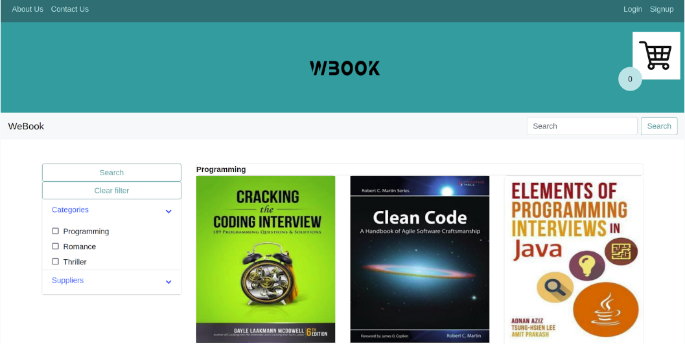

#WeBook

Online Shop  and eCommerce web-application with Java.

- Books can be searched by suppliers and topics
- Only registered visitors can add products to the cart
- Checkout items and make payments (paypal or card)
- Email confirmation of each purchase
- Order history is available under the profile
- Log history and order details file(JSON) are generated(only for admins)
 
  

Built with:
  - Java
  - Java Servlets 
  - Thymeleaf 
  - JDBC
  - SLF4J

